# Flow-Py

Flow-Py is an open source gravitational mass flows (GMFs) run out model. The main objective of this tool is to compute the spatial extent of GMFs, which consists of the track/path and deposition areas of GMFs in three dimensional terrain. The resulting run out is mainly dependent by the terrain and the location of the starting/release point. No temporal equations are solved in the model. Flow-py uses existing statistical-data-based approaches for solving the routing and stopping of GMFs. 

This tool has been designed to be computationally light, allowing it application on a regional scale. This tool is written in python and takes advantage of pythons object oriented class structure. The organization of the tool allows users to address specific GMF research questions by keeping the parameterization flexible and the ability to include custom model extensions/ad-ons.

## Setting up Python3 environment

Flow-py works on Linux and Windows computers in a Python3 environment. 

#### Linux, Windows 

run the following command in the terminal to install the required packages:

```markup
pip install -r requirements.txt
```

If you have trouble installing GDAL or rasterio on Windows use these links to get the needed version directly from their website, first install GDAL and then rasterio.

GDAL:https://www.lfd.uci.edu/~gohlke/pythonlibs/#gdal

rasterio:https://www.lfd.uci.edu/~gohlke/pythonlibs/#rasterio

#### MacOS 

Haven't tested it on MacOS, if you are able to run it there, please give us feedback.

## Running the Code

Once necessary libraries are installed the model will run via the main.py script. Flow-Py can be run in the terminal or with a simple GUI which helps organize the input date/parameterizations.

#### Graphical user interface version 

```markup
python3 main.py --gui 
```

#### Terminal version

The terminal version needs the following arguments which are explained .

- alpha_angle (controls run out distance)
- exponent (controls concentration of routing flux)
- working directory path
- path to DEM raster (.tiff or .asc)
- path to release raster (.tiff or .asc)  
- (Optional) flux threshold (positive number) flux_threshold=xx (limits spreading with the exponent)
- (Optional) Max z_{\delta} (positive number) max_z_delta=xx (max kinetic energy height, turbulent friction)

Here is an example for running Flow-Py over a simple parabolic slope with a channelized path and a small bump/hill in the run out area. Input data can be found in example directory

```markup
python3 main.py alpha_angle exponent working_directory path_to_dem path_to_release flux_threshold=positiv_number(Optional) max_z_delta=positiv_number(Optional
```

##### Example:

```markup
python3 main.py 25 8 ./examples/dam/ ./examples/dam/dam_010m_standard_cr100_sw250_f2500.20.6_n0.asc ./examples/dam/release_dam.tif flux=0.003 max_z=270
```

## Input Files

All  GIS raster files must be in the .asc or .tif format.

All rasters need the same  resolution (normal sizes are 5x5 or 10x10 meters).

All Layers need the same spatial extend, with no data values > 0 (standard no data values = -9999).

### Input Files:

- DEM:
	- The DEM Raster file needs a no data value lower then zero. standard = -9999
	
- Release Zones:
	- The release layer needs values higher then zero for the release pixels. NoData < 0, or -9999
### Optional Input Files:

- Infrastructure:
	- The infrastructure layer needs values higher then zero for infrastructure. Different values can be used for 
	different infrastructures classes and will be saved in the backtracking.
	- The backtracking layer has the information of the infrastructure that was hit. Higher values win over lower ones.
## Output

All outputs are in the .tiff raster format in the same resolution and extent as the input GIS layers.

- z_delta: the maximum z_delta for every raster cell.
- sum_z_delta: z_delta summed up on every raster cell.
- Flux: The maximum routing flux for every raster cell.
- Cell_Counts: number of release cells that route flux through a raster cell.
- Flow Path Travel Angle, FP_TA: the γ angle along the flow path
- Straight Line Travel Angle, SL_TA: Saves the γ angle, while the distances are calculated via a straight line from the release cell to the current cell

### Back-tracking extension

The back-tracking extension is an example of a custom built model extension used to identify the release areas, tracks/paths and deposition areas of GMFs that endanger infrastructure. 

To activate the back-tracking extension an additional GIS input layer that describes the spatial extent of the infrastructure must be called into the model. The GUI version of the model has a field where an infrastructure layer can be uploaded. For the terminal version the “infra= path_to_infrastructure_raster” must be included as an argument (see command below).

```markup
python3 main.py alpha_angle exponent working_directory path_to_dem path_to_release infra=path_to_infrastructure(Optional) flux_threshold=positiv_number(Optional) max_z_delta=positiv_number(Optional)
```

##### Example:

```markup
python3 main.py 25 8 ./examples/dam/ ./examples/dam/dam_010m_standard_cr100_sw250_f2500.20.6_n0.asc ./examples/dam/release_dam.tif infra=./examples/dam/infra.tif flux=0.003 max_z=270
```

The infrastructure layer must be in the same extent and resolution as the other input GIS layers. Raster cells that contain infrastructure must have values > zero, raster cells with values = 0 represent locations without infrastructure (see infrastructure.tif in example folder).  Different values can be used to differentiate types infrastructure. When a raster cell is associated with endangering >1 infrastructure types the larger values is saved.

##### Back-tracking output:

- z_delta: the maximum z_delta for every raster cell.
- Flux: The maximum routing flux for every raster cell.
- Flow Path Travel Angle, FP_TA: the γ angle along the flow path
- Straight Line Travel Angle, SL_TA: Saves the γ angle, while the distances are calculated via a straight line from the release cell to the current cell
- Back-tracking: Areas identified as endangering infrastructure. 


## Motivation 2D


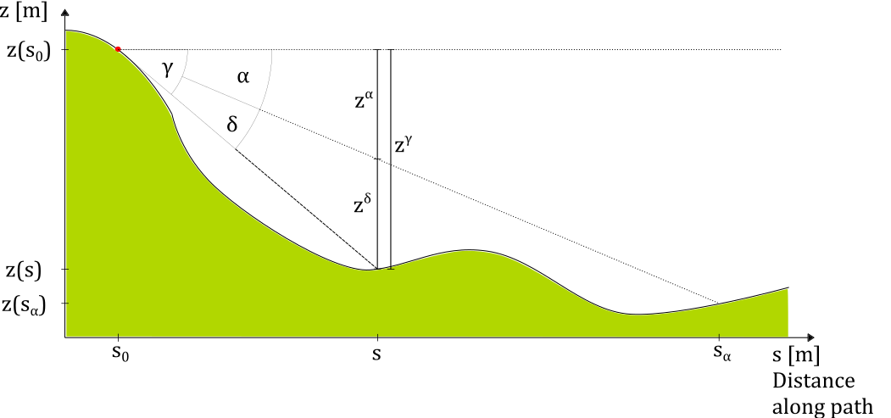
*Fig. 1: Definition of angles and distances for the calculation of z_delta, where s is the distance along the path and z(s) the corresponding altitude.*

The model equations that control the run out in three dimensional terrain are mostly motivated with respect to geometric two dimensional concepts, that control the main routing and final stopping of the flow.

Figure 1 summarizes the basic concept of a constant run out angle (alpha) with the corresponding geometric relations in two dimensions along a possible process path.

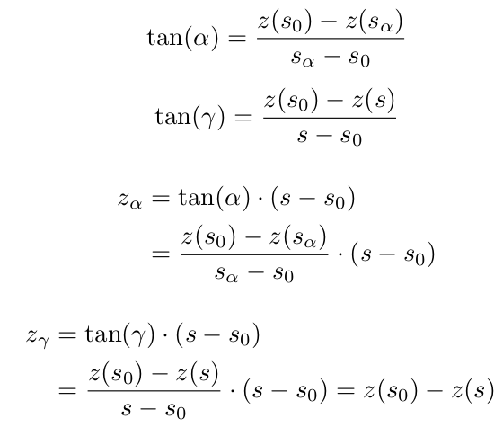

The local travel angle gamma is defined by the height and distance difference from the release point to the current location.

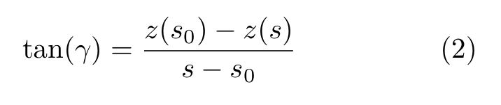

The angle delta is the difference between gamma and alpha and is associated to the energy left in the process, so when delta equals zero or gamma equals alpha, the maximum runout distance is reached.

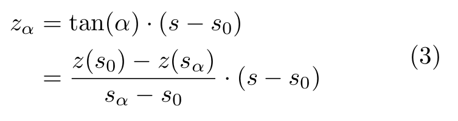

Z_alpha can be interpreted as dissipation energy.

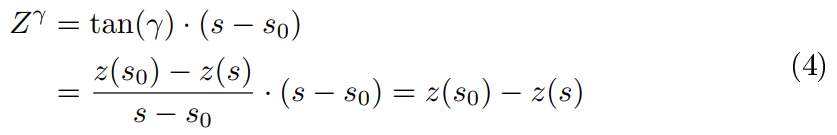

Z_gamma is the height difference between the starting point and the current calculation step at s. 

Z_delta is the difference between Z_gamma and Z_alpha, so when Z_delta is lower or equal zero the calculation stops. Z_delta can also be interpreted as the energy left in the process.

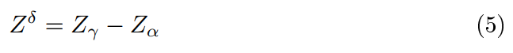

## Handling the Spatial Input

To run the model at least 2 main raster inputs are needed. First the digital elevation model on which we solve the equations, and second the release raster, which defines were the starting points or release cells are on the raster. 

For every release cell we start the calculation. The goal is to determine potential children via 2 stopping criteria. 

- Z_delta has to be greater then zero: Z_delta > 0
- Routing Flux has to be greater then the Routing cut off: R_i > R_Stop

If the criteria are fulfilled the child is saved in the path and for every cell/child in the path we search for new potential children.

If we reach the end of the path and no new children fulfill the criteria we close the calculation and save the needed information from the path to our output raster files. Then the calculation starts again for the next release cell. The spatial extend and magnitude for all release cells are summarized in the output raster files, which represent the overlay of all paths.

Every path is independent from the other, but depending on the information we want to extract, we save the highest values (Z_delta) or sums (Cell Counts) of different paths to the output raster file.

## Iterative Calculation Steps on the Path

Here we will go through all calculation steps as they are in the code under: flow_class.calc_distribution()

To bring the thoughts from the motivation from 2D model to a 3D grid we must implement a few new definitions.

​	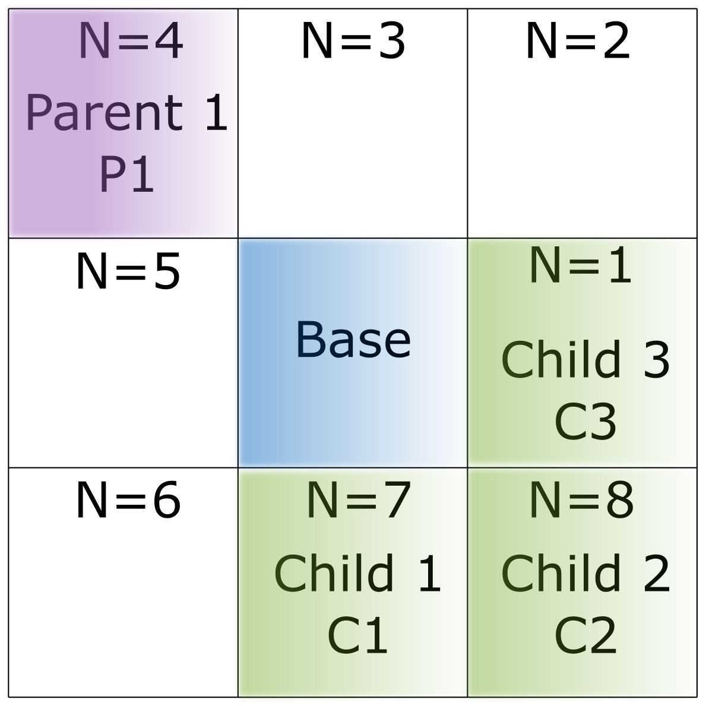

*Fig. 2: Definition of parent, base, child and neighbors, as well as the indexing around the base.*

First we need to bring in the definition for base. This is the current raster cell we are looking at, and from which we do our calculations. This would be at distance s along the path in Fig. 1. 

Every base can have one or more parents, except the starting cell, where we start our calculation, this would be at s = s_0 in Fig. 1.

### z_delta

From the base we solve now the equations (6,7 and 8) for every neighbor n, if Z_bn^{delta} is higher then zero, this neighbor is defined as a potential child of this base, and spreading is allowed in this direction.

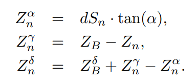

Here S_bn is the projected distance between the base and the neighbor.

As Z_bn^{delta} can be interpreted as  kinetic energy it is possible to limit this value to a maximum. Regarding physical models this would correspond to a turbulent friction. 

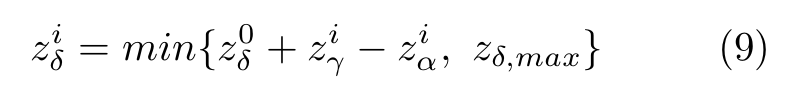

The path to one of the neighbors (S_n) equals the path to the base (S_b) plus the path from base to the neighbor (S_bn) (Eq. 9). 

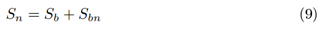

As there are many possibilities for the path from the starting point to our current base, we just take into account the shortest path, which corresponds to the highest Z_delta in the base. If Z_delta,max is set to infinity, or as in the code to 8898 m (= Mount Everest), we can calculate the shortest path from the starting point to our base with Eq. 10. 

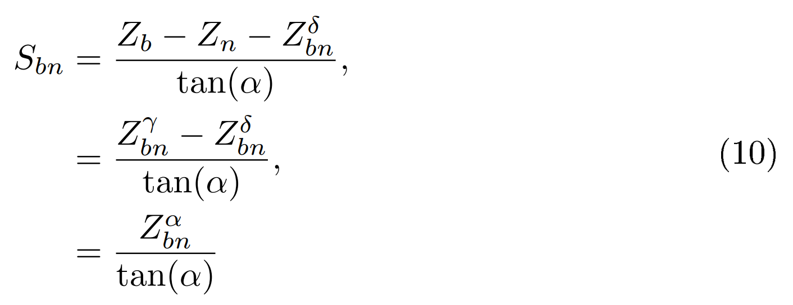

With this equations we determine the maximum run out distance for the process, in the next steps we will explain how we handle and calculate the spreading on the 3D grid.


### Persistence Function

The persistence function P_i aims to reproduce the behavior of inertia, and weights the flow 
direction based on the change in direction with respect to the previous direction [3].
We introduced to scale the direction with Z_delta of the incoming direction (Z_delta,parent), 
so the direction from a cell with higher Z_delta will have more affect to the directions where the base cell spreads.

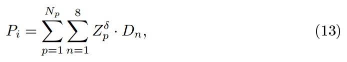

The weights are defined by the cosine of the angle between parent, base and child/neighbor minus pi:  
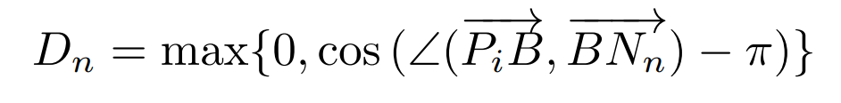

So there are max. 3 childs that get input via the persistence function from one parent.

In the first calculation step, at the release or start cell, the persistence is set to one, because there exists no parent. So the first calculation step is totally dependent on the terrain.

### Terrain based routing

The terrain based routing is dependent on the slope angle. The Holmgren (1994) algorithm [1] is used in different kind of models and works well for avalanches but also rockfall or soil slides.
The exponent exp allows to control the divergence of the spreading. For avalanches a exponent of 8 shows good results.
To reach a single flow in step terrain (rockfall, soil slides, steepest descend), an exponent of 75 is considered.

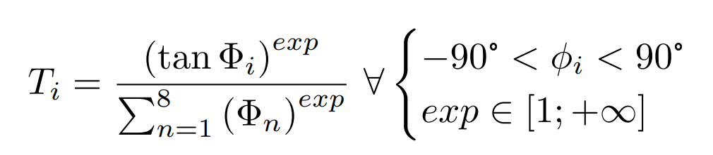
*Holmgrem Algorithm from 1994 [1]*


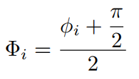


### Flux 

The values given by the terrain based routing and the persistence function are combined according to Eq.(16).


, where i is the direction and n are the neighbors from 1 to 8. R_i is then the flux that flows in direction i.
R_b is the flux in the base, for a release cell or starting cell the flux of the base equals one. \
The result of Eq. (16) is a 3 x 3 array with assigned flux values. A normalization stage is then 
required to bring the sum of the R_i's to the value of R_b. This aims at avoiding loss of flux [2].

### Flow Chart / Overview

In Fig. 3 the whole computational process is shown, and which files handles which computation. 

The main.py file handles the input for the model and splits the release layer in tiles and saves them in a release list. Then the main.py starts one process per tile, which calls the flow_core.py and starts the calculation for one path. The number of processes is depending on the used Hardware setting (CPU and RAM).  Whenever a new Cell is created flow_core.py calls flow_class.py and makes a new instance of this class, which is saved in the path. When the calculation in flow_core.py is finished it returns the path to main.py which saves the result to the output rasters. 


*Fig.3: Flow Chart of the whole computational process of Flow-Py, and an overview of the files and what they manage.*


### References

[1] [Holmgren, P. (1994).](https://www.researchgate.net/publication/229484151_Multiple_flow_direction_algorithms_for_runoff_modelling_in_grid_based_elevation_models_An_empirical_evaluation) 
Multiple flow direction algorithms for runoff modelling in
grid based elevation models: an empirical evaluation. Hydrological Processes, 8:327–334.

[2] [Horton, P., Jaboyedoff, M.,
Rudaz, B., and Zimmermann, M. (2013).](https://nhess.copernicus.org/articles/13/869/2013/nhess-13-869-2013.pdf) 
Flow-R, a model for susceptibility mapping of debris
flows and other gravitational hazards at a regional scale. Natural Hazards and Earth System
Science, 13:869–885.

[3] [Gamma, P. (1999).](https://www.researchgate.net/publication/34432465_dfwalk-Ein_Murgang-Simulationsprogramm_zur_Gefahrenzonierung) dfwalk - Ein
Murgang-Simulationsprogramm zur Gefahrenzonierung. PhD thesis, Universität Bern.

[4] Huber, A., Fischer, J. T., Kofler, A., and Kleemayr, K. (2016). Using spatially
distributed statistical models for avalanche runout estimation. In International Snow Science Workshop, Breckenridge, Colorado, USA - 2016.  

## Contact

For Questions contact:  
Michael Neuhauser, Austrian Research Centre for Forest: Michael.Neuhauser@bfw.gv.at  
Christopher D'Amboise, Austrian Research Centre for Forest: Christopher.DAmboise@bfw.gv.at


This study was carried out in the framework of the GreenRisk4Alps project
ASP635, funded by the European Regional Development Fund through the Interreg Apline Space programme  