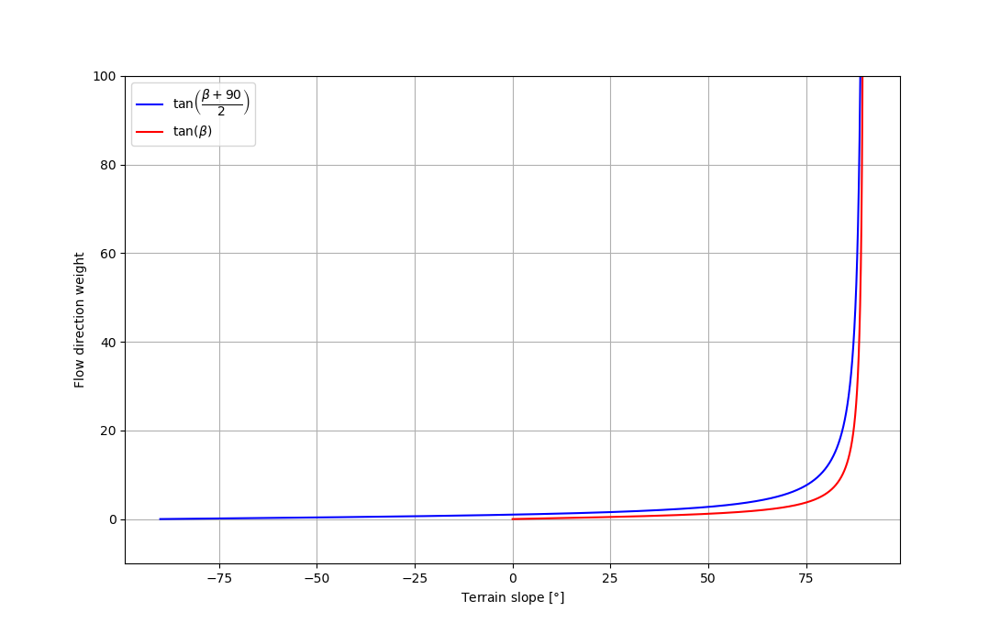

# Flow-Py

To define protective functions and to quantify the protective effects of forests, we created the Flow-Py model that 
identifies process areas of gravitational hazards, including avalanches, rockfall and debris slides. The model is 
written in Python to keep it easy adjustable. The run out routine of Flow-Py is based on the principles of energy 
conservation including frictional dissipation assuming simple coulomb friction, leading to constant travel-angle. 
Potential release areas and the corresponding travel angle have to be adapted for each type of gravitational mass movements. 
A important improvement, compared to similar models, is that it can handle mass movement in flat and uphill terrain. 
One major advantage of this model is its simplicity, resulting in a computationally inexpensive implementation, which 
allows for an application on a regional scale, covering large simulation areas. The adaptivity of the model further 
allows to consider existing infrastructure and to detect starting zones endangering the corresponding areas in a back-calculation step. 
Additionally, by adding forest cover to the simulations we can identify which forest area has a protective function and, 
based on information about forest structure, calculate the protective effect this forest provides to down slope infrastructure.

## Running the Code

python3 main.py --gui -> Gui Version  
python3 main.py alpha_angle exponent working_directory path_to_dem path_to_release infra=path_to_infrastructure(Optional) flux_threshold=positiv_number(Optional) max_z_delta=positiv_number(Optional)

- alpha_angle: max. runout angle for the process: Austria -> Avalanche 25, Rockfall 35, Debris Slides 22 
- exponent: controls the lateral spreading, avalanches 8, rockfall and debris slides 75 (= single flow, except in flat terrain) 
- working_directory: where to create and save result folder 
- path_to_dem: well it's the path to the DEM (.asc or .tif)
- path_to_release: well it's the path to the release layer 
- path_to_infrastructure: well it's the path to the Infra layer, Optional!
- flux_threshold: when Flow-Py stops the spreading, Standard = 0.0003, Optional!
- max_z_delta: The max. z_delta your process can reach. Some hints: Avalanche = 270 /  Rockfall = 50 / Soil Slides = 12 / Standard = 8848 (no limitation), Optional!

Right now the Code works on Linux and Windows Machines. Haven't tested it on MacOS, if you are able to run it there, please give us feedback.
Run the Code via the main.py script: python3 main.py ...  
Some PyQt libraries are needed and rasterio.  
There is the requirements.txt file in the repo that includes all needed libraries. (Work in progress...)

## Input Files

All input files need to be .asc or .tif files.  
All files need the same raster resolution, normal sizes are 5x5 or 10x10 meters.  
All Layers need the exact same extend. If not, the Code will give you feedback which layer is not accurate.

### Input Files:

- DEM:
	- The DEM Raster file needs a no data value lower then zero. standard = -9999
	
- Release Zones:
	- The release layer needs values higher then zero for the release pixels. NoData < 0, or -9999
	
### Optional Input Files:

- Infrastructure:
	- The infrastructure layer needs values higher then zero for infrastructure. Different values can be used for 
	different infrastructures classes and will be saved in the backcalculation.
	- The backcalculation layer has the information of the infrastructure that was hit. Higher values win over lower ones.
	
## Output

- z_delta:
    Includes the highest z_delta for every pixel.
- Sum of z_delta:
    z_delta summed up on every pixel.
- Flux:
    The result of the flux calculation for every pixel.
- Cell Counts:
    Saves how often one pixel gets a hit from different release points.
- Backcalculation:
    Saves the backcalculation from Infrastructure to release point
- Flow Path Travel Angle, FP_TA:
    Saves the &gamma; angle along the flow path
- Straight Line Travel Angle, SL_TA:
    Saves the &gamma; angle, while the distances are calculated via a straight line from the release cell to the current cell
    
## Calculation Steps

### z_delta 

*Fig. 1: Definition of angles and distances for the calculation of z_delta*

	

### Terrain based routing

Teh terrain based routing is dependend on the slope angle. The Holmgren (1994) algorithm [1] is used in 
different kind of models and works well for avalanches but also rockfall or soil slides.
The exponent exp allows to control the divergence of the spreading. For avalanches a exponent of 8 shows good results.
To reach a single flow in step terrain, an exponent of 75 is considered.

*Holmgrem Algorithm from 1994 [1]*

In this equation i, j are the flow directions, T_i the flux proportion in direction i, 
tan(beta_i) the slope gradient between the base cell and the cell in direction i, and exp the variable exponent. 
When the exponent increases, the divergence is reduced up to resulting into a single flow direction when 
exp &rightarrow; &infin;. This parameter allows to control the spreading and to reproduce a wide range of other flow 
accumulations.
This approach works for tan(beta) > 0. To take in account flow in flat terrain and upwards, in this case 
tan(beta) < 0, this approach was changed to the range for tangents from -90 degrees to 90 degrees, as seen in 
Fig. 2.

*Fig. 2: Distribution functions for terrain based routing, in red the standard Holmgrem, in blue our modification*

### Persistencec Function

The persistence function P_i aims to reproduce the behavior of inertia, and weights the flow 
direction based on the change in direction with respect to the previous direction (see Fig. 3) [3].
We introduced to scale the direction with z_delta of the incoming direction (z_delta,parent), 
so the direction from a cell with higher z_delta will have more affect to the directions where the base cell spreads.

The weights are defined by the cosine of the direction angles:  

*Fig. 3: jkh*

### Overall Susceptibility 

The values given by the flow direction algorithm and the weighting of the persistence are combined according to Eq.(13)

where i, j are the flow directions, p_i is the susceptibility value in direction i, p_i^(fd) 
the flow proportion according to the flow direction algorithm, p_i^p the flow proportion according 
to the persistence, and p_0 the previously determined susceptibility value of the central cell. 
For a release cell p_0 equals one. \
The result of Eq.(13) is a 3 x 3 array with assigned susceptibility values. A normalization stage is then 
required to bring the sum of the cells to the value of p_0. 
This aims at avoiding loss of susceptibility [2].

### References

[1] [Holmgren, P. (1994).](https://www.researchgate.net/publication/229484151_Multiple_flow_direction_algorithms_for_runoff_modelling_in_grid_based_elevation_models_An_empirical_evaluation) 
Multiple flow direction algorithms for runoff modelling in
grid based elevation models: an empirical evaluation. Hydrological Processes, 8:327–334.

[2] [Horton, P., Jaboyedoff, M.,
Rudaz, B., and Zimmermann, M. (2013).](https://nhess.copernicus.org/articles/13/869/2013/nhess-13-869-2013.pdf) 
Flow-R, a model for susceptibility mapping of debris
flows and other gravitational hazards at a regional scale. Natural Hazards and Earth System
Science, 13:869–885.

[3] [Gamma, P. (1999).](https://www.researchgate.net/publication/34432465_dfwalk-Ein_Murgang-Simulationsprogramm_zur_Gefahrenzonierung) dfwalk - Ein
Murgang-Simulationsprogramm zur Gefahrenzonierung. PhD thesis, Universität Bern.

## Contact

For Questions contact:  
Michael Neuhauser, Austrian Research Centre for Forest: Michael.Neuhauser@bfw.gv.at  
Christopher D'Amboise, Austrian Research Centre for Forest: Christopher.DAmboise@bfw.gv.at